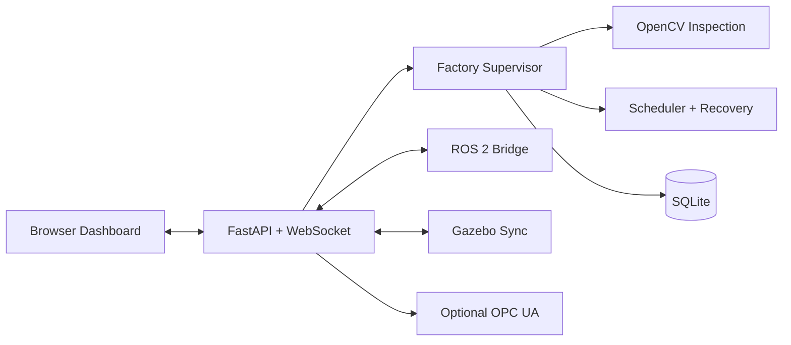

# ReConFactory Digital Twin


A fault-aware smart factory simulation with an animated browser twin, OpenCV
inspection, automatic rerouting, SQLite analytics, ROS 2 integration, and a
synchronized Gazebo factory.

## What It Demonstrates

| Area | Implementation |
|---|---|
| Factory automation | Product recipes, queues, machine states, scheduling and quality control |
| Processing | Two capability-based processing stations |
| Machine vision | OpenCV color, shape and missing-section inspection |
| Resilience | Fault detection, diagnosis, recovery and automatic rerouting |
| Visualization | Animated browser dashboard and synchronized Gazebo scene |
| Data | SQLite events, products, machine snapshots, sensors and faults |
| Analytics | Throughput, cycle time, utilization, downtime and recovery metrics |
| Integration | ROS 2 state/fault/command topics and optional OPC UA |
| Quality | 74 automated tests plus Ruff lint and formatting checks |

## Factory Flow

```text
Input -> Vision -> Processing A --\
                  Processing B ----> Quality -> Accepted / Rejected
```

- **Processing A:** drilling and assembly
- **Processing B:** drilling and polishing
- Compatible work is rerouted when a processing station fails.
- Work is paused safely when no valid alternative exists.

## Architecture



The Python supervisor is the source of truth for product state, scheduling,
fault handling and persistence. Browser, Gazebo and ROS 2 integrations consume
the same backend state.

## Quick Start

### PowerShell

```powershell
cd path\to\production_line
.\run_powershell.ps1
```

Open `http://127.0.0.1:8000`.

### Ubuntu or WSL

```bash
cd /path/to/production_line
bash run_ubuntu.sh
```

This starts the web backend and, when installed, ROS 2, Gazebo and the Gazebo
sync bridge from one terminal. Press `Ctrl+C` in that terminal to stop the
stack.

### Manual Python Setup

```bash
python -m venv .venv
```

PowerShell:

```powershell
.\.venv\Scripts\Activate.ps1
python -m pip install -r requirements.txt
python scripts\run_factory.py
```

Linux:

```bash
source .venv/bin/activate
python -m pip install -r requirements.txt
python scripts/run_factory.py
```

### Docker

```bash
docker compose -f docker/docker-compose.yml up --build
```

## Machine Vision

The live vision station runs this pipeline:

1. Generate a simulated inspection frame for the current product.
2. Convert the frame to HSV.
3. Segment the colored product.
4. Extract the largest contour.
5. Classify red, blue or green.
6. Classify block, cylinder or component geometry.
7. Compare contour area to detect missing material.
8. Accept the product or route it to rejection.

Implementation:

- `vision/inspector.py`
- `vision/opencv_inspector.py`
- `reconfactory/supervisor.py`
- `tests/test_opencv_vision.py`

Inspection events expose the method, detected color, shape, area ratio and
confidence. OpenCV currently analyzes generated simulation frames, not pixels
from a physical or Gazebo camera.

## ROS 2

The Ubuntu launcher builds and starts four ROS 2 nodes:

- `/reconfactory_supervisor`
- `/reconfactory_station_controller`
- `/reconfactory_fault_detector`
- `/reconfactory_logger`

Main topics:

- `/reconfactory/factory_state`
- `/reconfactory/faults`
- `/reconfactory/factory_command`
- `/reconfactory/station_command`

See [ROS 2 integration](docs/ROS2_INTEGRATION.md) for command examples.

## Tests

```bash
python -m pytest
python -m ruff check .
python -m ruff format --check .
```

Current result: **74 passed**.

GitHub Actions runs the same checks on every push and pull request.

## Useful Commands

```bash
python scripts/check_integrations.py
python scripts/generate_sensor_data.py
python scripts/run_experiment.py
python scripts/export_report.py
```

## Project Structure

```text
app/               FastAPI application
frontend/          Browser dashboard
reconfactory/      Automation, scheduling, faults, recovery and persistence
vision/            OpenCV inspection
analytics/         Metrics and report exports
maintenance/       Machine health scoring
gazebo_fallback/   Gazebo world and synchronization bridge
ros2_ws/           ROS 2 package
industrial/        Optional OPC UA server
config/            Product, machine, fault and routing configuration
tests/             Automated test suite
docs/              Technical documentation
```

## Documentation

- [Architecture](docs/architecture.md)
- [API](docs/api.md)
- [Machine vision](docs/VISION_SYSTEM.md)
- [ROS 2 integration](docs/ROS2_INTEGRATION.md)
- [Gazebo integration](docs/GAZEBO_FALLBACK.md)
- [Database schema](docs/database_schema.md)
- [Fault model](docs/fault_model.md)
- [OPC UA](docs/OPC_UA.md)
- [Demo scenarios](docs/DEMO_SCENARIOS.md)
- [Contributing](CONTRIBUTING.md)

## Limitations

- This is a software-first educational digital twin, not an industrial safety
  controller.
- Gazebo and ROS 2 require their external Ubuntu/WSL runtimes.
- Machine vision uses generated inspection frames rather than a live camera
  stream.
- OPC UA is optional and runs as a separate process.

## License

MIT. See [LICENSE](LICENSE).
