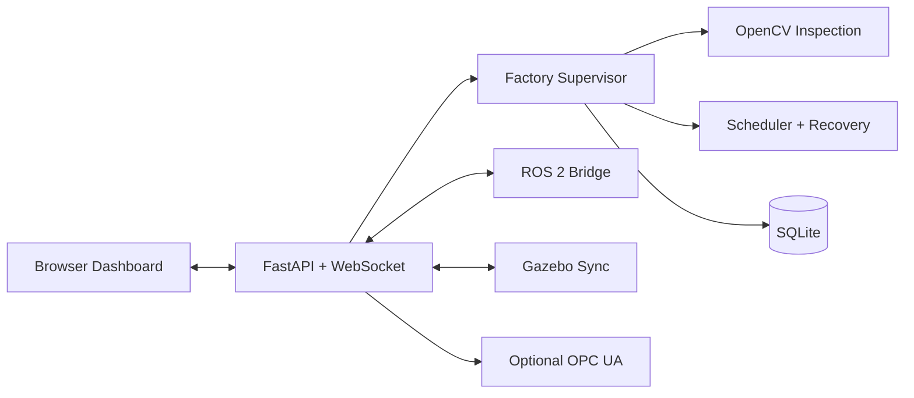

# ReConFactory Digital Twin


[](https://github.com/jalal006/reconfactory-digital-twin/actions/workflows/tests.yml)


A fault-aware smart factory simulation with an animated browser twin, OpenCV
inspection, automatic rerouting, SQLite analytics, ROS 2 integration, and a
synchronized Gazebo factory.

## What It Demonstrates

| Area | Implementation |
|---|---|
| Factory automation | Product recipes, queues, machine states, scheduling and quality control |
| Processing | Two capability-based processing stations |
| Machine vision | OpenCV color, shape and missing-section inspection |
| Resilience | Fault detection, diagnosis, recovery and automatic rerouting |
| Visualization | Animated browser dashboard and synchronized Gazebo scene |
| Data | SQLite events, products, machine snapshots, sensors and faults |
| Analytics | Throughput, cycle time, utilization, downtime and recovery metrics |
| Integration | ROS 2 state/fault/command topics and optional OPC UA |
| Quality | 74 automated tests plus Ruff lint and formatting checks |

## Factory Flow

```text
Input -> Vision -> Processing A --\
                  Processing B ----> Quality -> Accepted / Rejected
```

- **Processing A:** drilling and assembly
- **Processing B:** drilling and polishing
- Compatible work is rerouted when a processing station fails.
- Work is paused safely when no valid alternative exists.

## Architecture



The Python supervisor is the source of truth for product state, scheduling,
fault handling and persistence. Browser, Gazebo and ROS 2 integrations consume
the same backend state.

## Install And Run

### What You Need

- Python 3.11 or newer
- Git
- Windows PowerShell for the browser/backend demo
- Ubuntu 24.04 or WSL Ubuntu for the full ROS 2 + Gazebo demo
- ROS 2 Jazzy, Gazebo Sim and `colcon` only if you want the full simulation

The project always runs the browser dashboard and FastAPI backend. The Ubuntu
launcher also starts ROS 2 and Gazebo when those tools are installed.

### Windows PowerShell

```powershell
git clone https://github.com/jalal006/reconfactory-digital-twin.git
cd reconfactory-digital-twin
Set-ExecutionPolicy -Scope Process -ExecutionPolicy Bypass
.\run_powershell.ps1
```

Open:

```text
http://127.0.0.1:8000
```

This creates `.venv`, installs `requirements.txt`, and starts the web app.
PowerShell mode is the easiest way to run the browser twin without ROS 2 or
Gazebo.

### Ubuntu Or WSL

Install basic tools:

```bash
sudo apt update
sudo apt install -y python3 python3-venv python3-pip git curl
```

Clone and run:

```bash
git clone https://github.com/jalal006/reconfactory-digital-twin.git
cd reconfactory-digital-twin
bash run_ubuntu.sh
```

Open:

```text
http://127.0.0.1:8000
```

This creates `.venv-wsl`, installs `requirements.txt`, starts the backend, and
then starts ROS 2 and Gazebo automatically if they are available. Press
`Ctrl+C` in that same terminal to stop everything.

### Full ROS 2 + Gazebo Setup

Use Ubuntu 24.04 or WSL Ubuntu 24.04. Install ROS 2 Jazzy from the official ROS
2 Ubuntu deb guide, then install the project simulation tools:

```bash
sudo apt update
sudo apt install -y python3-colcon-common-extensions ros-jazzy-ros-gz
```

Make ROS 2 available in new terminals:

```bash
echo "source /opt/ros/jazzy/setup.bash" >> ~/.bashrc
source ~/.bashrc
```

Check the tools:

```bash
ros2 --version
gz sim --version
python3 --version
```

Run the full stack from one terminal:

```bash
cd ~/reconfactory-digital-twin
bash run_ubuntu.sh
```

Useful official install references:

- ROS 2 Jazzy Ubuntu install: <https://docs.ros.org/en/jazzy/Installation/Ubuntu-Install-Debs.html>
- Gazebo Ubuntu install: <https://gazebosim.org/docs/latest/install_ubuntu/>
- Gazebo quick test: <https://gazebosim.org/docs/latest/getstarted/>

### Manual Python Setup

Use this when you only want to run the backend manually.

PowerShell:

```powershell
python -m venv .venv
.\.venv\Scripts\Activate.ps1
python -m pip install --upgrade pip
python -m pip install -r requirements.txt
python scripts\run_factory.py --host 127.0.0.1 --port 8000
```

Ubuntu or WSL:

```bash
python3 -m venv .venv-wsl
source .venv-wsl/bin/activate
python -m pip install --upgrade pip
python -m pip install -r requirements.txt
python scripts/run_factory.py --host 0.0.0.0 --port 8000
```

### Docker

```bash
docker compose -f docker/docker-compose.yml up --build
```

### Verify The Install

```bash
python scripts/check_integrations.py
python -m pytest
python -m ruff check .
python -m ruff format --check .
```

### Common Fixes

If port `8000` is busy, stop the old process first.

PowerShell:

```powershell
Get-NetTCPConnection -LocalPort 8000 -ErrorAction SilentlyContinue |
  Select-Object -ExpandProperty OwningProcess -Unique |
  ForEach-Object { Stop-Process -Id $_ -Force }
```

Ubuntu or WSL:

```bash
fuser -k 8000/tcp
```

If PowerShell blocks the launcher script:

```powershell
Set-ExecutionPolicy -Scope Process -ExecutionPolicy Bypass
.\run_powershell.ps1
```

If Gazebo or ROS 2 does not start, run:

```bash
python scripts/check_integrations.py
tail -80 logs/backend.log
tail -80 logs/ros2.log
tail -80 logs/gazebo.log
tail -80 logs/gazebo_sync.log
```

## Machine Vision

The live vision station runs this pipeline:

1. Generate a simulated inspection frame for the current product.
2. Convert the frame to HSV.
3. Segment the colored product.
4. Extract the largest contour.
5. Classify red, blue or green.
6. Classify block, cylinder or component geometry.
7. Compare contour area to detect missing material.
8. Accept the product or route it to rejection.

Implementation:

- `vision/inspector.py`
- `vision/opencv_inspector.py`
- `reconfactory/supervisor.py`
- `tests/test_opencv_vision.py`

Inspection events expose the method, detected color, shape, area ratio and
confidence. OpenCV currently analyzes generated simulation frames, not pixels
from a physical or Gazebo camera.

## ROS 2

The Ubuntu launcher builds and starts four ROS 2 nodes:

- `/reconfactory_supervisor`
- `/reconfactory_station_controller`
- `/reconfactory_fault_detector`
- `/reconfactory_logger`

Main topics:

- `/reconfactory/factory_state`
- `/reconfactory/faults`
- `/reconfactory/factory_command`
- `/reconfactory/station_command`

See [ROS 2 integration](docs/ROS2_INTEGRATION.md) for command examples.

## Tests

```bash
python -m pytest
python -m ruff check .
python -m ruff format --check .
```

Current result: **74 passed**.

GitHub Actions runs the same checks on every push and pull request.

## Useful Commands

```bash
python scripts/check_integrations.py
python scripts/generate_sensor_data.py
python scripts/run_experiment.py
python scripts/export_report.py
```

## Project Structure

```text
app/               FastAPI application
frontend/          Browser dashboard
reconfactory/      Automation, scheduling, faults, recovery and persistence
vision/            OpenCV inspection
analytics/         Metrics and report exports
maintenance/       Machine health scoring
gazebo_fallback/   Gazebo world and synchronization bridge
ros2_ws/           ROS 2 package
industrial/        Optional OPC UA server
config/            Product, machine, fault and routing configuration
tests/             Automated test suite
docs/              Technical documentation
```

## Documentation

- [Architecture](docs/architecture.md)
- [API](docs/api.md)
- [Machine vision](docs/VISION_SYSTEM.md)
- [ROS 2 integration](docs/ROS2_INTEGRATION.md)
- [Gazebo integration](docs/GAZEBO_FALLBACK.md)
- [Database schema](docs/database_schema.md)
- [Fault model](docs/fault_model.md)
- [OPC UA](docs/OPC_UA.md)
- [Demo scenarios](docs/DEMO_SCENARIOS.md)

## Limitations

- This is a software-first educational digital twin, not an industrial safety
  controller.
- Gazebo and ROS 2 require their external Ubuntu/WSL runtimes.
- Machine vision uses generated inspection frames rather than a live camera
  stream.
- OPC UA is optional and runs as a separate process.

## License

MIT. See [LICENSE](LICENSE).
