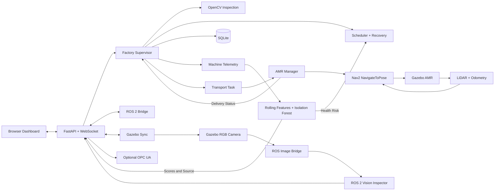

# ReConFactory Digital Twin


[](https://github.com/jalal006/reconfactory-digital-twin/actions/workflows/tests.yml)


A fault-aware smart factory digital twin with Gazebo camera perception,
ROS 2 / OpenCV inspection, optional Nav2 autonomous robot transport, an animated
browser dashboard, ML-based predictive maintenance, automatic rerouting and
recovery, and SQLite analytics.

An optional **single-AMR transport mode** adds a differential-drive Gazebo robot,
LiDAR, AMCL localization and Nav2 delivery tasks. The supervisor waits for actual
navigation success before starting work at the destination.
AMR mode uses expanded workcells around a central transport aisle, with direct
drill-to-quality access; the original conveyor layout remains the default.

## Camera And Control Features

- Gazebo-rendered RGB images feed a ROS 2 OpenCV inspector; five valid frames
  produce one product inspection result used by the existing factory supervisor.
- Raw and annotated camera topics expose detected color, contour and PASS/FAIL.
  Camera acceptance checks color only; final simulated Quality Control rejects
  injected wrong-shape, missing-part and quality defects.
- Browser-only synthetic vision remains available without ROS or Gazebo, with
  an explicit fallback label when a camera inspection times out.
- Browser movement waits through delayed Gazebo updates without reversing steps;
  Accepted and Rejected outputs remain terminal in both views.
- Slow integration checks run outside the API event loop. Start/Pause provides
  immediate pending feedback, and stationary Gazebo products avoid repeated pose
  commands.
- A runtime checker verifies delivered camera images and detects duplicate ROS
  nodes. Python regression tests and JavaScript movement tests protect both modes.

## What It Demonstrates

| Area | Implementation |
|---|---|
| Factory automation | Product recipes, queues, machine states, scheduling and quality control |
| Processing | Two capability-based processing stations |
| Machine vision | Gazebo camera color inspection; synthetic color, shape and missing-section inspection |
| Resilience | Fault detection, diagnosis, recovery and automatic rerouting |
| Predictive maintenance | Isolation Forest telemetry scoring and health-aware processing assignments |
| Visualization | Animated browser dashboard and synchronized Gazebo scene |
| Data | SQLite events, products, machine snapshots, sensors and faults |
| Analytics | Throughput, cycle time, utilization, downtime and recovery metrics |
| Integration | ROS 2 state/fault/command topics and optional OPC UA |
| Robot transport | One differential-drive AMR, LiDAR, AMCL, Nav2 and delivery-gated production |
| Quality | Automated regression tests plus Ruff lint and formatting checks |

## Factory Flow

```text
Input -> Vision -> Processing A --\
                  Processing B ----> Quality -> Accepted / Rejected
```

- **Processing A:** drilling and assembly
- **Processing B:** drilling and polishing
- Compatible work is rerouted when a processing station fails.
- Work is paused safely when no valid alternative exists.

## Architecture


```mermaid
flowchart LR
    UI[Browser Dashboard] <--> API[FastAPI + WebSocket]
    API --> SUP[Factory Supervisor]
    SUP --> VIS[OpenCV Inspection]
    SUP --> SCH[Scheduler + Recovery]
    SUP --> DB[(SQLite)]
    SUP --> TELEMETRY[Machine Telemetry]
    TELEMETRY --> HEALTH[Rolling Features + Isolation Forest]
    HEALTH -->|Health Risk| SCH
    HEALTH -->|Scores and Source| API
    API <--> ROS[ROS 2 Bridge]
    API <--> GZ[Gazebo Sync]
    GZ --> CAM[Gazebo RGB Camera]
    CAM --> ROSIMG[ROS Image Bridge]
    ROSIMG --> VISNODE[ROS 2 Vision Inspector]
    VISNODE --> API
    SUP --> TASK[Transport Task]
    TASK --> AMR[AMR Manager]
    AMR --> NAV[Nav2 NavigateToPose]
    NAV --> ROBOT[Gazebo AMR]
    ROBOT --> SENS[LiDAR + Odometry]
    SENS --> NAV
    AMR -->|Delivery Status| SUP
    API --> OPC[Optional OPC UA]
```

The Python supervisor is the source of truth for product state, scheduling,
fault handling and persistence. Browser, Gazebo and ROS 2 integrations consume
the same backend state.

## Install And Run

Choose browser-only operation, the default Gazebo conveyor simulation, or the
optional [AMR transport mode](#autonomous-robot-transport). The default remains
`TRANSPORT_MODE=simulated`: browser/Windows/Docker need no Nav2 or ROS installation.

### What You Need

- Python 3.11 or newer
- Git
- Windows PowerShell for the browser/backend demo
- Ubuntu 24.04 or WSL Ubuntu for the full ROS 2 + Gazebo demo
- ROS 2 Jazzy, Gazebo Sim and `colcon` only if you want the full simulation

The project always runs the browser dashboard and FastAPI backend. The Ubuntu
launcher also starts ROS 2 and Gazebo when those tools are installed.

### Windows PowerShell

```powershell
git clone https://github.com/jalal006/reconfactory-digital-twin.git
cd reconfactory-digital-twin
Set-ExecutionPolicy -Scope Process -ExecutionPolicy Bypass
.\run_powershell.ps1
```

Open:

```text
http://127.0.0.1:8000
```

This creates `.venv`, installs `requirements.txt`, and starts the web app.
PowerShell mode is the easiest way to run the browser twin without ROS 2 or
Gazebo.

### Ubuntu Or WSL

Install basic tools:

```bash
sudo apt update
sudo apt install -y python3 python3-venv python3-pip git curl
```

Clone and run:

```bash
git clone https://github.com/jalal006/reconfactory-digital-twin.git
cd reconfactory-digital-twin
bash run_ubuntu.sh
```

Open:

```text
http://127.0.0.1:8000
```

This creates `.venv-wsl`, installs `requirements.txt`, starts the backend, and
then starts ROS 2 and Gazebo automatically if they are available. Press
`Ctrl+C` in that same terminal to stop everything.

### Full ROS 2 + Gazebo Setup

Use Ubuntu 24.04 or WSL Ubuntu 24.04. Install ROS 2 Jazzy from the official ROS
2 Ubuntu deb guide, then install the project simulation tools:

```bash
sudo apt update
sudo apt install -y python3-colcon-common-extensions ros-jazzy-ros-gz ros-jazzy-cv-bridge
```

Make ROS 2 available in new terminals:

```bash
echo "source /opt/ros/jazzy/setup.bash" >> ~/.bashrc
source ~/.bashrc
```

Check the tools:

```bash
ros2 --help
gz sim --version
python3 --version
```

Run the full stack from one terminal:

```bash
cd ~/reconfactory-digital-twin
bash run_ubuntu.sh
```

Useful official install references:

- ROS 2 Jazzy Ubuntu install: <https://docs.ros.org/en/jazzy/Installation/Ubuntu-Install-Debs.html>
- Gazebo Ubuntu install: <https://gazebosim.org/docs/latest/install_ubuntu/>
- Gazebo quick test: <https://gazebosim.org/docs/latest/getstarted/>

### Autonomous Robot Transport

After the ROS 2 Jazzy + Gazebo setup above, install the navigation dependencies:

```bash
sudo apt install -y ros-jazzy-navigation2 ros-jazzy-nav2-bringup \
  ros-jazzy-nav2-regulated-pure-pursuit-controller ros-jazzy-nav2-smac-planner \
  ros-jazzy-robot-state-publisher ros-jazzy-xacro ros-jazzy-tf2-tools
source /opt/ros/jazzy/setup.bash
TRANSPORT_MODE=amr VISION_SOURCE=gazebo bash run_ubuntu.sh
```

Run from the repository root. The launcher builds the ROS packages, generates
the expanded factory world/maps, and starts the backend, camera, robot and Nav2
from one terminal. Open `http://127.0.0.1:8000`, add a product and press Start.
Stop everything with `Ctrl+C` before switching modes or restarting.

- A central aisle gives both drills direct access to Quality.
- Smac planning and Regulated Pure Pursuit provide collision-aware navigation;
  the robot stops at a destination before the supervisor starts processing.
- The browser shows confirmed station deliveries and transport status, not a
  second robot navigation simulation.
- Payload loading is logical. Failed or cancelled transports require Reset;
  the system never silently substitutes successful simulated delivery.

For configuration, RViz, task/status topics and troubleshooting, see
[AMR Navigation](docs/AMR_NAVIGATION.md).

### Manual Python Setup

Use this when you only want to run the backend manually.

PowerShell:

```powershell
python -m venv .venv
.\.venv\Scripts\Activate.ps1
python -m pip install --upgrade pip
python -m pip install -r requirements.txt
python scripts\run_factory.py --host 127.0.0.1 --port 8000
```

Ubuntu or WSL:

```bash
python3 -m venv .venv-wsl
source .venv-wsl/bin/activate
python -m pip install --upgrade pip
python -m pip install -r requirements.txt
python scripts/run_factory.py --host 0.0.0.0 --port 8000
```

### Docker

```bash
docker compose -f docker/docker-compose.yml up --build
```

### Verify The Install

```bash
python scripts/check_integrations.py
python -m pytest
python -m ruff check .
python -m ruff format --check .
```

### Common Fixes

If port `8000` is busy, stop the old process first.

PowerShell:

```powershell
Get-NetTCPConnection -LocalPort 8000 -ErrorAction SilentlyContinue |
  Select-Object -ExpandProperty OwningProcess -Unique |
  ForEach-Object { Stop-Process -Id $_ -Force }
```

Ubuntu or WSL:

```bash
fuser -k 8000/tcp
```

If PowerShell blocks the launcher script:

```powershell
Set-ExecutionPolicy -Scope Process -ExecutionPolicy Bypass
.\run_powershell.ps1
```

If Gazebo or ROS 2 does not start, run:

```bash
python scripts/check_integrations.py
tail -80 logs/backend.log
tail -80 logs/ros2.log
tail -80 logs/gazebo.log
tail -80 logs/gazebo_sync.log
```

## Predictive Maintenance

An optional Isolation Forest estimates machine health from 12-sample temperature,
vibration and current windows. The scheduler adds a health-risk penalty when choosing
compatible processing stations; critical machines can be excluded from new work.
Existing jobs, hard-fault recovery and the rule-based `HealthScorer` remain intact.
Dashboard cards and ROS expose the estimator source and normalized anomaly score,
not a claimed fault probability.

```bash
source .venv-wsl/bin/activate
python -m pip install -r requirements.txt
python scripts/train_health_model.py
python scripts/run_experiment.py --maintenance --seed 42 --ticks 180
MAINTENANCE_MODE=ml HEALTH_AWARE_SCHEDULING=1 bash run_ubuntu.sh
```

Measured seed-42 synthetic trial (180 ticks, identical workload and degradation):

| Metric | Baseline | Health-Aware |
|---|---:|---:|
| Completed products | 23 | 23 |
| Hard faults / downtime ticks | 1 / 20 | 1 / 20 |
| Throughput, products/tick | 0.12778 | 0.12778 |
| Average cycle time, ticks | 7.39 | 7.83 |
| Predictive diversions | 0 | 18 |
| Mean anomaly at assignment | 0.43594 | 0.00494 |

Health-aware scheduling used lower-risk machines, with slightly slower cycles;
it did **not** reduce the exogenously imposed fault or improve throughput.
Held-out synthetic evaluation detected 88.85% of degraded windows with 0.46%
healthy false positives. See [Predictive Maintenance](docs/PREDICTIVE_MAINTENANCE.md)
for setup, model/security limitations, API/ROS topics and a live demo, and
[measured evaluation](docs/MAINTENANCE_VERIFICATION.md) for definitions.

ML is opt-in; rules and normal scheduling remain the defaults. Train the local
artifact before enabling ML. It is intentionally not committed to Git.
September 22 verification: **213 tests pass on Windows and Ubuntu**, Ruff passes,
and a real Gazebo camera + AMR cycle completed with ML scheduling enabled.

## Machine Vision

The vision system supports two modes:

- `VISION_SOURCE=synthetic`: default browser-safe mode. OpenCV inspects a
  generated simulation frame, so Windows and Docker do not need ROS 2 or Gazebo.
- `VISION_SOURCE=gazebo`: full Ubuntu/WSL mode. Gazebo renders an RGB camera
  image at the vision station, ROS 2 transports it, and the ROS vision node
  sends one aggregated inspection result back to the supervisor.

Synthetic mode pipeline:

1. Generate a simulated inspection frame for the current product.
2. Convert the frame to HSV.
3. Segment the colored product.
4. Extract the largest contour.
5. Classify red, blue or green.
6. Classify block, cylinder or component geometry.
7. Compare contour area to detect missing material.
8. Accept the product or route it to rejection.

Gazebo camera mode pipeline:

Camera acceptance checks color only. Shape and area are diagnostic measurements;
they do not reject a Gazebo-camera product. Synthetic mode retains shape and
missing-material checks, including when a camera timeout triggers fallback.

Final Quality Control checks injected wrong-shape, missing-part and quality
defects independently of camera color inspection. These defects are rejected at
Quality with a reason in the log; they are not accepted as finished products.

```text
Gazebo RGB Camera
-> ros_gz_bridge sensor_msgs/Image
-> /reconfactory_vision_inspector
-> OpenCV frame aggregation
-> /reconfactory/vision/result JSON
-> /api/vision/result
-> FactorySupervisor quality/routing logic
```

Implementation:

- `vision/inspector.py`
- `vision/opencv_inspector.py`
- `reconfactory/supervisor.py`
- `ros2_ws/src/reconfactory_ros/reconfactory_ros/vision_inspector_node.py`
- `tests/test_opencv_vision.py`
- `tests/test_gazebo_camera_vision.py`

Inspection events expose the method, detected color, shape, area ratio and
confidence. In Gazebo mode the final decision is gated by the current product
waiting at the vision station; the node aggregates five valid frames and
publishes one authoritative result. If the camera result does not arrive before
the timeout, the supervisor falls back to synthetic OpenCV inspection and records
`opencv_after_camera_timeout` (or the rule-based equivalent), not `gazebo_camera`.

Run the camera demo from the repository root:

```bash
VISION_SOURCE=gazebo bash run_ubuntu.sh
```

In a second Ubuntu terminal, from the repository root:

```bash
source /opt/ros/jazzy/setup.bash
source ros2_ws/install/setup.bash
python3 scripts/check_vision_pipeline.py
ros2 topic echo /reconfactory/vision/result
```

Start the result listener before spawning. Spawn a normal red block, then a red
block with `wrong_colour`: expect camera acceptance followed by color rejection.
For live images, install the optional viewer (`sudo apt install
ros-jazzy-rqt-image-view`) and run `ros2 run rqt_image_view rqt_image_view
/reconfactory/vision/debug_image` in another terminal. The annotated stream is
published during active inspection; the raw stream runs continuously.

## ROS 2

The Ubuntu launcher builds and starts four factory nodes plus the vision node
when camera dependencies are available:

- `/reconfactory_supervisor`
- `/reconfactory_station_controller`
- `/reconfactory_fault_detector`
- `/reconfactory_logger`
- `/reconfactory_vision_inspector`

Main topics:

- `/reconfactory/factory_state`
- `/reconfactory/faults`
- `/reconfactory/factory_command`
- `/reconfactory/station_command`
- `/reconfactory/vision/image_raw`
- `/reconfactory/vision/result`
- `/reconfactory/vision/debug_image`

See [ROS 2 integration](docs/ROS2_INTEGRATION.md) for command examples.

## Tests

```bash
python -m pytest
python -m ruff check .
python -m ruff format --check .
```

See [camera requirements audit](docs/VISION_ACCEPTANCE_AUDIT.md) for verification
results, known limitations, and the remaining live demo checks.

Navigation verification (September 21, 2026): **183 Python tests passed on
Windows and Ubuntu**, with Ruff lint/format checks passing. Six actual Gazebo
navigation goals completed in 8.5-11.6 seconds each without full spins. A normal
red product completed the real-camera AMR production cycle in 54 seconds, excluding
startup. These are measured samples, not timing or reliability guarantees.
See [AMR verification](docs/AMR_VERIFICATION.md) for detailed results and limits.

With the normal demo stopped, reproduce the isolated navigation and production
checks from a sourced Ubuntu/WSL terminal:

```bash
source /opt/ros/jazzy/setup.bash
.venv-wsl/bin/python scripts/run_amr_smoke.py --navigation-only vision station_a quality station_b quality reject_output
.venv-wsl/bin/python scripts/run_amr_smoke.py --factory-only
```

Each check uses a separate database/port and stops its test services afterward.

GitHub Actions runs the same checks on every push and pull request.

In a sourced ROS terminal, system pytest plugins may conflict with the project
virtual environment. For a plugin-loading error such as missing `lark`, use
`env -u PYTHONPATH .venv-wsl/bin/python -m pytest` to run the same Python suite
without inherited ROS packages.

## Useful Commands

```bash
python scripts/check_integrations.py
python scripts/check_vision_pipeline.py
python scripts/generate_sensor_data.py
python scripts/run_experiment.py
python scripts/export_report.py
```

## Project Structure

```text
app/               FastAPI application
frontend/          Browser dashboard
reconfactory/      Automation, scheduling, faults, recovery and persistence
vision/            OpenCV inspection
analytics/         Metrics and report exports
maintenance/       Rule baseline, rolling telemetry features and Isolation Forest
gazebo_fallback/   Gazebo world and synchronization bridge
ros2_ws/           Factory ROS 2 integration and optional AMR/Nav2 package
industrial/        Optional OPC UA server
config/            Product, machine, fault and routing configuration
tests/             Automated test suite
docs/              Technical documentation
```

## Documentation

- [Architecture](docs/architecture.md)
- [API](docs/api.md)
- [Machine vision](docs/VISION_SYSTEM.md)
- [Predictive maintenance](docs/PREDICTIVE_MAINTENANCE.md)
- [Maintenance evaluation and A/B results](docs/MAINTENANCE_VERIFICATION.md)
- [ROS 2 integration](docs/ROS2_INTEGRATION.md)
- [Gazebo integration](docs/GAZEBO_FALLBACK.md)
- [AMR navigation](docs/AMR_NAVIGATION.md)
- [AMR verification and change inventory](docs/AMR_VERIFICATION.md)
- [Database schema](docs/database_schema.md)
- [Fault model](docs/fault_model.md)
- [OPC UA](docs/OPC_UA.md)
- [Demo scenarios](docs/DEMO_SCENARIOS.md)

## Limitations

- This is a software-first educational digital twin, not an industrial safety
  controller.
- Gazebo and ROS 2 require their external Ubuntu/WSL runtimes.
- Synthetic vision mode uses generated inspection frames. Gazebo vision mode
  uses rendered simulator pixels, not a physical camera.
- OPC UA is optional and runs as a separate process.
- AMR mode supports one robot and logical payload attachment, not physical
  grasping or fleet management. Live all-recipe/fault endurance testing remains
  broader than the completed navigation and normal-product checks.

## License

MIT. See [LICENSE](LICENSE).
