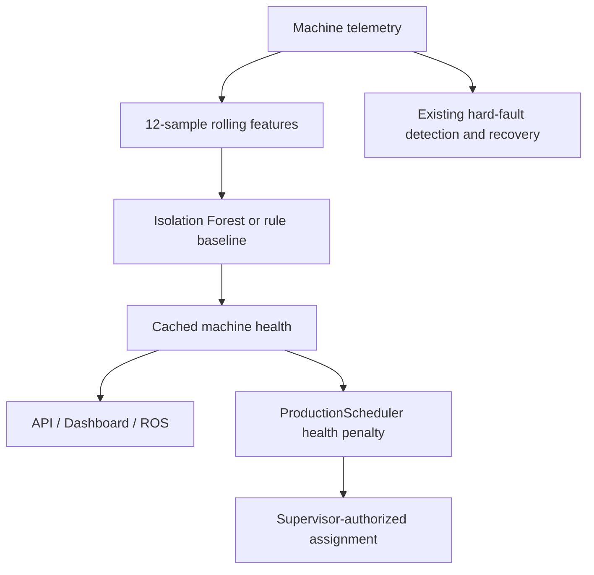

# Predictive Maintenance

Isolation Forest adds multivariate anomaly detection to the existing rule-based
`HealthScorer` and trend detector, which remain unchanged and usable independently.
The supervisor owns machine state; the estimator never moves products or injects
faults. Health affects only new processing assignments, in both conveyor and AMR
modes. Existing jobs finish normally unless the existing fault system stops them.



## Run

From the repository root, inside the project virtual environment:

```bash
python -m pip install -r requirements.txt
python scripts/generate_sensor_data.py --seed 42
python scripts/train_health_model.py --seed 42
python scripts/run_experiment.py --maintenance --seed 42 --ticks 180
```

Ubuntu browser/backend only (no ROS/Gazebo needed):

```bash
MAINTENANCE_MODE=ml HEALTH_AWARE_SCHEDULING=1 .venv-wsl/bin/python scripts/run_factory.py
```

Ubuntu full stack, optionally including robot transport:

```bash
MAINTENANCE_MODE=ml HEALTH_AWARE_SCHEDULING=1 TRANSPORT_MODE=amr bash run_ubuntu.sh
```

PowerShell:

```powershell
$env:MAINTENANCE_MODE = "ml"
$env:HEALTH_AWARE_SCHEDULING = "1"
.\run_powershell.ps1
```

Train using the environment that will run inference. `MAINTENANCE_MODE=rules`
and `HEALTH_AWARE_SCHEDULING=0` restore the baseline. Configuration also lives in
`config/maintenance.yaml`; explicit supervisor arguments override environment,
which overrides YAML. The default remains rules with health scheduling disabled.

`HEALTH_MODEL_PATH` optionally selects a local artifact. Relative configured paths
resolve from the repository root. Explicit ML mode **fails clearly** for missing,
corrupt or incompatible artifacts; it does not claim ML inference succeeded.
Before 12 samples arrive, predictions explicitly report `source=rules` and a
warmup reason. Reset clears history. A recovered machine retains its recent
history until the rolling window replaces it, so scheduling may remain cautious.

## Telemetry And Features

`maintenance/telemetry.py` extends the existing sensor-data generator with seeded
healthy duty cycles/noise and progressive bearing, overheating and mechanical-load
scenarios. Baseline readings cover the simulator's temperature, vibration and
idle/running current ranges. This is a controllable synthetic model, not validated
industrial physics. Scenario labels and baseline rule scores in the CSV are for
evaluation only: training generates separate healthy-only sequences.

`maintenance/features.py` fixes the feature order to:

1. Latest temperature (C), vibration (mm/s), current (A).
2. Window means in that same signal order.
3. Population standard deviations in that order.
4. Least-squares slopes in that order.

There are **12 features over 12 samples**. Slopes are per sample, not per second;
production samples once per supervisor tick before assignment. Use regularly
sampled telemetry. Histories are bounded and separated by machine; nonfinite or
mixed-machine windows are rejected. No padding fabricates an ML-ready window.

## Model And Scores

`maintenance/ml.py` uses scikit-learn IsolationForest: 128 trees, 256 maximum
samples/tree, `contamination=auto`, `random_state=42`, `n_jobs=1`. It is a compact
unsupervised baseline for multivariate telemetry and needs no defect labels to fit.
See the [official estimator documentation](https://scikit-learn.org/stable/modules/generated/sklearn.ensemble.IsolationForest.html).

Raw abnormality is `-score_samples(features)`. Separate healthy calibration
sequences define reference `q95` and span `max(0.02, 2*(q99.5-q95))`.
Normalized anomaly is `clip((raw-reference)/span, 0, 1)`; health is `1-anomaly`.
Neither score is a calibrated fault probability or remaining useful life.

| Anomaly | Interpretation |
|---|---|
| < 0.2 | healthy |
| 0.2 to < 0.5 | watch |
| 0.5 to < 0.8 | degrading |
| >= 0.8 | critical |

Rule mode adapts the legacy `warning` status to `degrading`; the original public
`HealthScorer` API still returns its original statuses. Reasons show signal means
and slopes as descriptive evidence, not causal model explanations.

The joblib artifact has JSON metadata containing schema/model version, exact
feature order, window size, seed, estimator parameters, calibration, scikit-learn
version, evaluation and SHA-256. Loading checks compatibility and integrity.
**Only load locally trained or trusted artifacts:** joblib can execute code; a
checksum is not a signature. Re-train after changing scikit-learn version.
See [scikit-learn persistence limitations](https://scikit-learn.org/stable/model_persistence.html).

For offline inference, use `MLHealthEstimator.load(path).predict(sensor_history)`;
`generate_sequence(...)` or a list of `SensorPoint` values supplies the history.
Online `HealthMonitor` caches one prediction per machine per tick; snapshots and
WebSocket/ROS publication do not run repeated inference.

## Scheduling And Persistence

The scheduler first enforces capabilities, availability, hard faults and AMR
occupancy constraints. Existing processing-time/utilization/preference costs stay
intact. The configurable health penalties are healthy 0, watch 2, degrading 12,
critical 30; critical machines are excluded by default. If no compatible eligible
station exists, work waits rather than moving to an incapable/faulted machine.
Disable critical exclusion only deliberately; it remains a configurable demo policy.

`predictive_reroute` records a new assignment that differs from the ordinary
cost-based choice, including product, operation, avoided/selected machines,
scores, estimator source and reason. It does not teleport work already assigned.
`machine_health_changed` records status/source transitions. Both use the existing
SQLite event JSON. Machine snapshot JSON contains the full prediction; maintenance
warning rows are emitted only on transitions, not every sample. No schema migration
or destructive database change is required.

## Dashboard, API And ROS

Machine cards show health %, normalized anomaly %, colored status, estimator source
and descriptive reasons on hover. Predictive assignments appear in the event log.

- `GET /api/status` and `/ws`: each machine has `machine_health`; stats include
  `predictive_diversions`. Top-level mode and scheduling-enabled flags are exposed.
- `GET /api/maintenance`: mode, scheduling switch and current predictions.
- `POST /api/telemetry`: simulation-only readings `{machine_id, temperature_c,
  vibration_mm_s, current_a}`. Finite, nonnegative fields are required. Unknown
  machine returns 404. Values are sampled on the next running tick; they do not
  themselves advance production. Repeated readings between ticks replace the
  pending values. The normal sensor simulation resumes after that tick.
- `/reconfactory/machine_health`: JSON `std_msgs/String`, `{machines: [...]}`,
  published at 2 Hz by the existing ROS supervisor bridge. Existing factory-state
  messages also contain health. No new ROS node or ML dependency inside ROS nodes.

```bash
source /opt/ros/jazzy/setup.bash
source ros2_ws/install/setup.bash
ros2 topic echo /reconfactory/machine_health
```

## Demo And Verification

Start ML mode, press Start, and add red blocks. In another activated terminal:

```bash
python scripts/demo_machine_health.py --machine station_a --scenario bearing
```

This feeds seeded simulated degradation for roughly 68 seconds; late samples can
trigger an actual hard fault. Show A's changing score/source, a predictive-reroute
event choosing B, and continued processing. Reset afterward. For a 45-60 second
portfolio recording, show the early warning and assignment change, then the saved
A/B table; explicitly mention the slower-cycle-time tradeoff.

```bash
python -m pytest
python -m ruff check .
python -m ruff format --check .
python scripts/run_experiment.py
python scripts/check_integrations.py
```

Measured results and evaluation definitions are in
[Maintenance Verification](MAINTENANCE_VERIFICATION.md). Synthetic scenario
performance does not prove field reliability; overheating has missed detections,
windows are correlated, and startup/load changes can look anomalous. The existing
hard-fault system is not replaced by ML. No online retraining, RUL, cloud service,
neural network or safety guarantee is provided.
